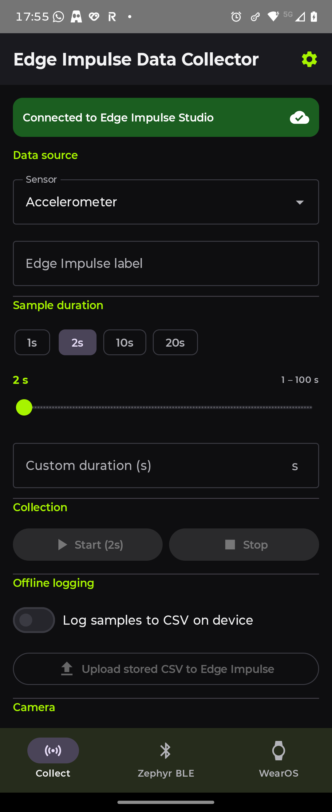
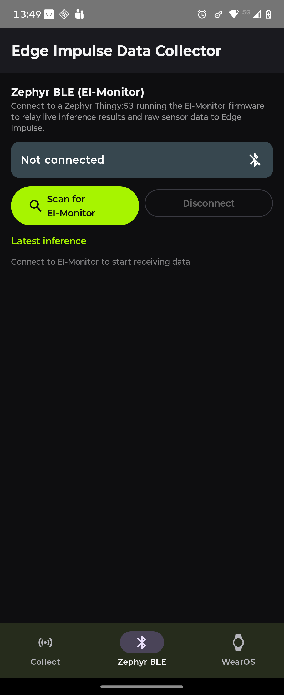
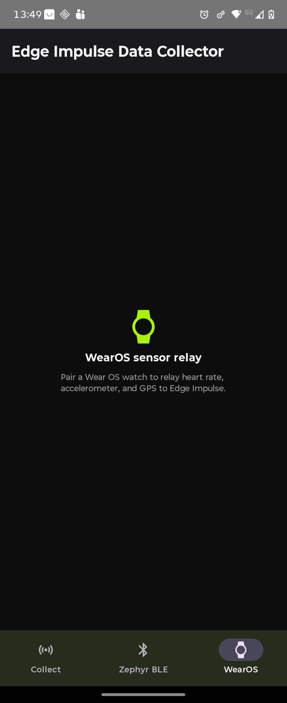
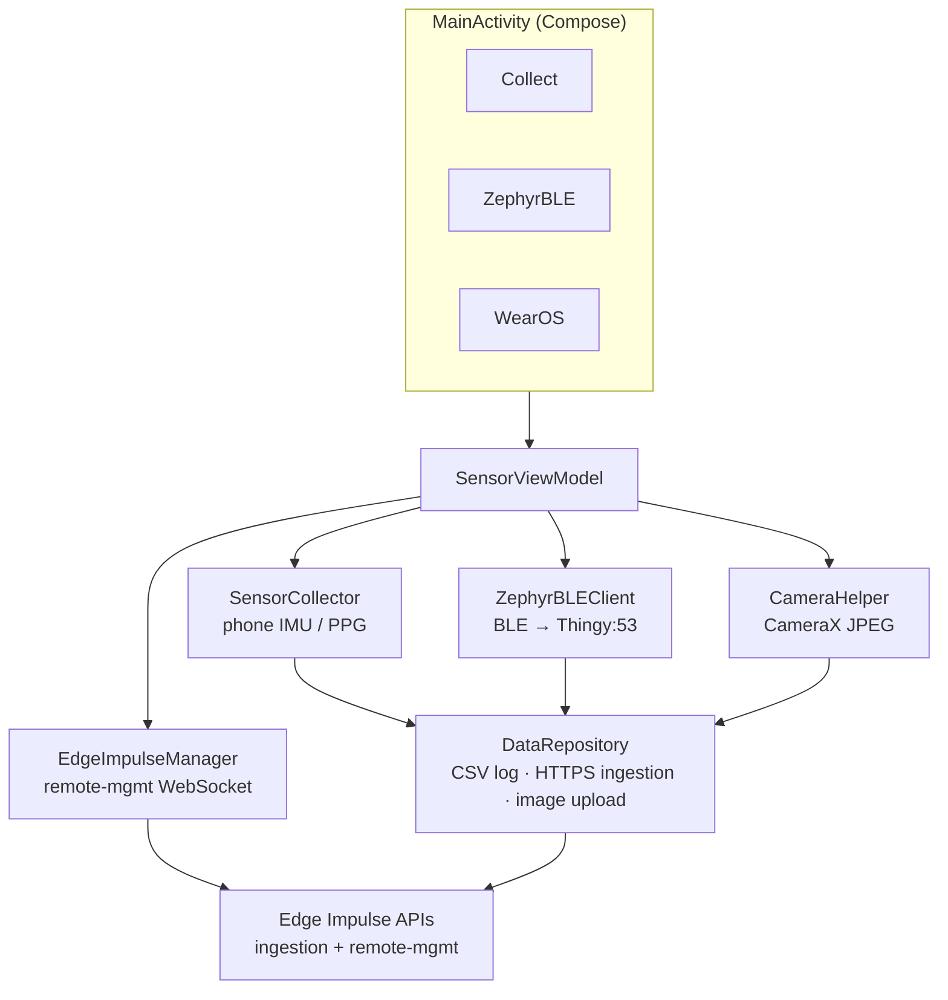

# Edge Impulse Data Collector — Android

An Android **DAC** (Data Acquisition Client) for the [Edge Impulse](https://edgeimpulse.com) platform. Collect phone sensor data, photos, and BLE-relayed sensor data from a Zephyr device, and upload directly to your Edge Impulse project.

> **Sample APK** — grab [`sample-apk/edge-impulse-data-collector.apk`](sample-apk/edge-impulse-data-collector.apk) to sideload without building.

---

## Overview


*System architecture: phone sensors, Zephyr BLE node, Wear OS watch, and USB-OTG devices all feed into the Android hub, which logs data locally and uploads to Edge Impulse.*

---

## Demo

<video src="https://github.com/user-attachments/assets/db2ade2c-ef3d-49ef-b849-49de9445de4d" controls width="720"></video>

*Collecting accelerometer data on the phone and uploading it live to Edge Impulse.*

---

## Screenshots

| Collect | Zephyr BLE | WearOS |
|:---:|:---:|:---:|
|  |  |  |

---

## Quick start — collect data & upload to your project

### Step 1 — Create an Edge Impulse project

1. Sign up / log in at [studio.edgeimpulse.com](https://studio.edgeimpulse.com).
2. Click **Create new project**, give it a name (e.g. `motion-classifier`).
3. Note the **Project ID** shown in the URL (`https://studio.edgeimpulse.com/studio/<PROJECT_ID>`).

### Step 2 — Get your API key

1. Inside your project, go to **Dashboard → Keys**.
2. Click **Add new API key** → copy the key (`ei_xxxxxxxxxxxxxxxxxxxxxxxxxxxxxxxx`).

### Step 3 — Configure the app

Open `gradle.properties` (or `~/.gradle/gradle.properties`) and add:

```properties
EI_API_KEY=ei_xxxxxxxxxxxxxxxxxxxxxxxxxxxxxxxx
```

Then build and install:

```bash
./gradlew :app:assembleDebug
adb install app/build/outputs/apk/debug/app-debug.apk
```

Or sideload the pre-built APK from [`sample-apk/`](sample-apk/).

### Step 4 — Collect sensor data (Accelerometer / PPG)

1. Open **Edge Impulse Data Collector** on your phone.
2. On the **Collect** tab:
   - **Sensor** — choose `Accelerometer` or `PPG (Heart Rate)`.
   - **Edge Impulse label** — type the class label for this recording (e.g. `walking`, `idle`, `running`). The label maps directly to the Edge Impulse training label.
3. Tap **Start** — the phone begins streaming sensor data live.  
   You'll see live X/Y/Z (or HR) values update on screen.
4. Tap **Stop** when done.  
   Data is uploaded immediately to your project via the ingestion API.
5. Repeat with different labels to build a balanced dataset.

> **Tip:** Aim for at least 2–3 minutes of data per class. Edge Impulse will split it into windows automatically.

### Step 5 — Upload images (image classification / object detection)

1. Type a label in the **Edge Impulse label** field (e.g. `crack`, `no_crack`).
2. Scroll to the **Camera** section.
3. Tap **Capture & upload image** — the rear camera fires, and the JPEG is uploaded to your project with that label.
4. Repeat to build an image dataset.

### Step 6 — Offline / field logging

Use this when you have no data connection (e.g. outdoors, factory floor):

1. Enable **Log samples to CSV on device** with the toggle.
2. Tap **Start** / **Stop** as normal — samples accumulate in a local CSV file.
3. When back online, enter a label and tap **Upload stored CSV to Edge Impulse** to batch-upload everything.

### Step 7 — Verify data in Edge Impulse Studio

1. Open your project in [studio.edgeimpulse.com](https://studio.edgeimpulse.com).
2. Go to **Data acquisition** — your uploaded samples appear with their labels, timestamps, and sensor axes.
3. Use the **Training / Test split** slider to allocate data.
4. Proceed to **Create impulse → Add processing block → Add learning block → Train** your model.

---

## Secondary data sources

### Zephyr BLE (EI-Monitor firmware)

The **Zephyr BLE** tab connects to a Nordic Thingy:53 running the companion [`ei-zephyr-ble-gatt-client`](https://github.com/edgeimpulse/ei-zephyr-ble-gatt-client/) firmware. The Thingy runs Edge Impulse inference locally and pushes results + raw IMU windows to the phone over BLE GATT, which are then relayed to your Edge Impulse project.

1. Flash the Thingy:53 with the `ei-zephyr-ble-gatt-client` firmware.
2. Open the **Zephyr BLE** tab.
3. Tap **Scan for EI-Monitor** — the device should appear in the list.
4. Tap the device to connect. The banner turns green and inference results stream in.
5. Raw IMU windows and labelled inference results are uploaded automatically.

### WearOS sensor relay


<video src="https://github.com/user-attachments/assets/bf1e00fa-0bdd-406b-95e1-28653e0bc14a" controls width="720"></video>


The **WearOS** tab relays heart rate, accelerometer, and GPS from a paired Wear OS watch via the Wearable Data Layer API. Pair your watch, install the companion wearable module from [`/wearosdatalogger`](wearosdatalogger), and data flows through the same upload pipeline.

---

## Setup from source

### Prerequisites
- Android Studio (Ladybug or later)
- Android device API 26+
- Edge Impulse account + project + API key

### Build

```bash
git clone https://github.com/edgeimpulse/example-android-inferencing.git
cd example-android-inferencing/android-data-collector

# Add your API key
echo "EI_API_KEY=ei_xxxx" >> ~/.gradle/gradle.properties

# Build & install
./gradlew :app:assembleDebug
adb install app/build/outputs/apk/debug/app-debug.apk
```

### Permissions

The app requests these on first launch — all are optional (none blocks the UI):

| Permission | Used by |
|---|---|
| `CAMERA` | Capture & upload image |
| `RECORD_AUDIO` | Future: speech/audio collection |
| `ACCESS_FINE_LOCATION` | BLE scanning (Android < 12) |
| `BODY_SENSORS` | PPG / heart rate |
| `BLUETOOTH_SCAN/CONNECT` | Zephyr BLE (Android 12+) |

---

## Architecture



### Data flows

| Source | Format | Edge Impulse endpoint |
|---|---|---|
| Phone accelerometer / PPG | `IngestionPayload` JSON | `POST /api/training/data` |
| Camera JPEG | binary `image/jpeg` | `POST /api/training/data` |
| Zephyr inference result | JSON `x-label` = inferred class | `POST /api/training/data` |
| Zephyr raw IMU | buffered CSV → flush on inference | `POST /api/training/data` |
| EI Studio remote trigger | WebSocket `wss://remote-mgmt.edgeimpulse.com` | stream |

### Zephyr BLE GATT profile

| Characteristic | UUID | Properties |
|---|---|---|
| Service | `12345678-1234-5678-1234-56789abcdef0` | — |
| Inference result | `…abcdef1` | NOTIFY |
| Sensor data | `…abcdef2` | NOTIFY |
| State | `…abcdef3` | READ/WRITE |

`inference_result_t` (52 bytes, little-endian ARM):
```
0  : char[32]  label
32 : float     confidence
36 : uint32_t  dsp_time_ms
40 : uint32_t  classification_time_ms
44 : uint64_t  timestamp
```

---

## File map

| File | Purpose |
|---|---|
| `MainActivity.kt` | Compose UI — 3 nav destinations |
| `SensorViewModel.kt` | Single ViewModel for all tabs |
| `SensorCollector.kt` | Android Sensor API → `SensorData` flow |
| `CameraHelper.kt` | CameraX → JPEG bytes |
| `ZephyrBLEClient.kt` | BLE central — scan, connect, parse Zephyr |
| `DataRepository.kt` | CSV logging + EI HTTPS uploads |
| `EdgeImpulseManager.kt` | Remote-mgmt WebSocket client |
| `GattProfile.kt` | UUIDs shared with firmware |
| `GattServerManager.kt` | Phone GATT server (WearOS relay) |
| `ViewModelFactory.kt` | Dependency wiring |

---

## Companion firmware

See [`ei-zephyr-ble-gatt-client`](../ei-zephyr-ble-gatt-client) — Thingy:53 / nRF5340 Zephyr firmware that runs EI inference and exposes the GATT service above.

---

## Extending this app with AI coding agents

This codebase is intentionally split into small, single-purpose components (`SensorCollector`, `CameraHelper`, `LocationCollector`, `AudioFileRecorder`, `DataRepository`, `WearOSClient`, `ZephyrBLEClient`, …) so you can drop them into your own Edge Impulse app and let an AI agent (Claude Code, GitHub Copilot, Gemini in Android Studio, Cursor, etc.) wire them up.

### Reuse map

| You want… | Files to copy / point your agent at |
|---|---|
| Phone sensor capture | `SensorCollector.kt`, `IngestionSample.kt`, `DataRepository.kt` (`uploadStoredCsvFiles`, ingestion DTOs) |
| Image capture + EI upload | `CameraHelper.kt`, `DataRepository.uploadImage` |
| Microphone capture + EI upload | `AudioFileRecorder.kt`, `DataRepository.uploadAudio` |
| Wear OS sensor relay | `wearosdatalogger/` module, `WearOSClient.kt`, `WearableMessageListenerService.kt`, `WearProtocol.kt` |
| BLE central for a Zephyr peripheral | `ZephyrBLEClient.kt`, `GattProfile.kt` |
| Remote-management (EI Studio “Connect device”) | `EdgeImpulseManager.kt`, `EdgeImpulseService.kt` |
| On-device CSV browsing / editing | `DatasetsScreen.kt`, `DatasetEditorScreen.kt`, `DataRepository` (`listStoredDatasets`, `loadDatasetFull`, `writeDataset`) |

A good starter prompt for an agent:

> *Using the components in `android-data-collector/app/src/main/java/com/edgeimpulse/gattsensors/`, build an app that captures `<your sensor>` for `<N>` seconds when a button is pressed and uploads each sample to my Edge Impulse project under the label entered in a text field. Reuse `DataRepository` for the upload and `SensorViewModel` as the pattern for state.*

### Android skills (Gemini / Android Studio agent)

Google publishes [Android skills](https://developer.android.com/tools/agents/android-skills) — `SKILL.md` instruction packs the agent loads on demand for tasks like *“migrate from XML to Compose”*, *“upgrade to AGP 9”*, *“set up Navigation 3”*, or *“make my UI edge-to-edge”*. They follow the [agentskills.io](https://agentskills.io/specification) open standard, so the same skill files work with Gemini in Android Studio, Claude Code, and any other agent that supports skills.

Install a stock skill with the Android CLI:

```bash
android skills list                          # browse available skills
android skills add --skill compose-migration # install one
```

Then prompt the agent (`@compose-migration` in Android Studio, or just *“migrate this screen to Compose”* with any agent) and it will pull in the skill's full instructions automatically.

You can also package your own conventions — e.g. an `edge-impulse-data-collection` skill that teaches the agent how to add a new sensor source to this app. Drop a `SKILL.md` under `.skills/<your-skill-name>/` at the repo root:

```markdown
---
name: edge-impulse-data-collection
description: Add a new sensor source to the Edge Impulse Data Collector
  Android app. Use this when the user asks to capture data from a new
  sensor (e.g. barometer, magnetometer, custom BLE peripheral) and
  upload it to Edge Impulse.
metadata:
  version: "1.0"
---

# Adding a new sensor source

1. Extend `SensorCollector.kt` (or create a sibling collector class) that
   emits `SensorData` on a `MutableSharedFlow`.
2. Add a new entry to `SensorViewModel.collectSourceOptions` so it shows
   in the "Sensor" dropdown on the Collect screen.
3. Handle the new option in `SensorViewModel.startSensorForDuration`.
4. Uploads go through `DataRepository.uploadStoredCsvFiles` (offline) or
   the existing ingestion path — do NOT add a new HTTP client.
5. Add a unit test in `app/src/test/.../SensorCollectorTest.kt`.

Permissions go in `app/src/main/AndroidManifest.xml` and are requested
in `MainActivity.optionalPermissions()`.
```

After committing the skill, any compatible agent in the workspace will pick it up when you say *“add a barometer source to the collector”*.

### Tip — Claude Code / `AGENTS.md`

For agents that read `AGENTS.md` or `CLAUDE.md` at the repo root, a short pointer like:

```markdown
# Edge Impulse Android Data Collector
- Build: `./gradlew :app:installDebug`
- Lint:  `./gradlew :app:lint`
- Reusable components live in `app/src/main/java/com/edgeimpulse/gattsensors/`
- Add new sensor sources via the steps in `.skills/edge-impulse-data-collection/SKILL.md`
```

…is usually enough to get the agent productive on the first turn.

